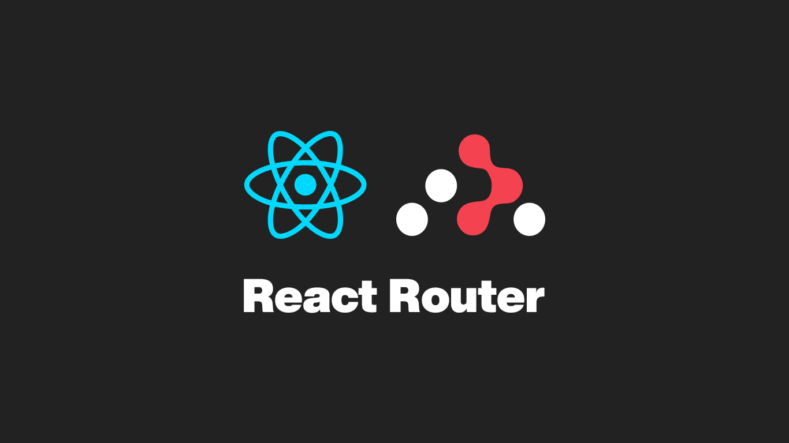
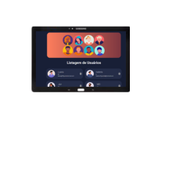

# 💻 Gerenciador de Usuários - Frontend

Este projeto é um <h2> Este foi um  projeto que aprendi no curso do DevClub <a href="https://rodolfomori.com.br/Devclub">clique aqui </a> Gerenciador de Usuários, com Professor Rodolfo Mori com **React**, utilizando **Vite** como bundler, **JavaScript**, e integração com uma **API externa** para operações de CRUD. O app permite listar, adicionar, editar e excluir usuários de forma dinâmica e responsiva.

## 🚀 Tecnologias Utilizadas

  
  
  
  
  
  
    
  
  
   
   
  

## 📦 Instalação

1. Clone o repositório:

🧠 Funcionalidades
🔍 Listagem de usuários

➕ Adição de novos usuários

✏️ Edição de dados existentes

❌ Remoção de usuários

🔄 Atualização automática com useEffect

🔃 Estados controlados com useState

## 📸 Demonstração

<!-- Telas no Notebook -->

  
💻 Tela do Projeto Rodando no Notebook

  

    
    
  

<!-- Telas no Tablet -->

  
🖥 Tela do Projeto Rodando no Tablet

  

    
    
  

<!-- Telas no Smartphone -->

  
📱 Tela do Projeto Rodando no Smartphone

  

    
    
  

---

# React + Vite

This template provides a minimal setup to get React working in Vite with HMR and some ESLint rules.

Currently, two official plugins are available:

- [@vitejs/plugin-react](https://github.com/vitejs/vite-plugin-react/blob/main/packages/plugin-react/README.md) uses [Babel](https://babeljs.io/) for Fast Refresh
- [@vitejs/plugin-react-swc](https://github.com/vitejs/vite-plugin-react-swc) uses [SWC](https://swc.rs/) for Fast Refresh

## Expanding the ESLint configuration

If you are developing a production application, we recommend using TypeScript and enable type-aware lint rules. Check out the [TS template](https://github.com/vitejs/vite/tree/main/packages/create-vite/template-react-ts) to integrate TypeScript and [`typescript-eslint`](https://typescript-eslint.io) in your project.
